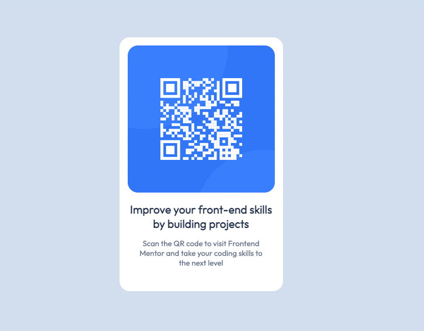

# Frontend Mentor - QR code component solution

Hello. This is a solution to the [QR code component challenge on Frontend Mentor](https://www.frontendmentor.io/challenges/qr-code-component-iux_sIO_H).

## Table of contents

- [Overview](#overview)
  - [Screenshot](#screenshot)
  - [Links](#links)
- [My process](#my-process)
  - [Built with](#built-with)
  - [What I learned](#what-i-learned)
  - [Continued development](#continued-development)
  - [Useful resources](#useful-resources)
- [Author](#author)

## Overview

This is my first time using Frontend Mentor. Frontend Mentor suggested I try this as my first challenge.

### Screenshot

### Links

- Solution URL: [Add solution URL here](https://your-solution-url.com)
- [Live site URL](https://lukeknipe.github.io/QR_code_component/)

## My process

### Built with

- HTML
- CSS
- Flexbox
- [Google Fonts](https://fonts.google.com/)

### What I learned

As a newbie to Frontend Mentor and something of a newbie to GitHub, I'm becoming better acquainted with both. This is my first time using GitHub's Markdown syntax, which is nice. I also have never used Sketch or Figma before. So for this project I used Sketch.

### Continued development

I'm looking forward to submitting this first solution and learning more with Frontend Mentor.

### Useful resources

- [Google, duh](https://www.google.com/) - The most useful resource of all. Can't remember a CSS property? Google it! Need a JavaScript function for a particular thing, and don't remember how to do it? Google to the rescue!
- [Chrome DevTools](https://developer.chrome.com/docs/devtools/) - An indispensable means of examining your code and what it's causing to happen (or not happen) in the browser.

**Note: Delete this note and replace the list above with resou

## Author

- Website - [Luke Knipe](https://lukeknipe.github.io)
- Frontend Mentor - [@lukeknipe](https://www.frontendmentor.io/profile/lukeknipe)
- Twitter - [@LukeKnipe](https://twitter.com/LukeKnipe)
